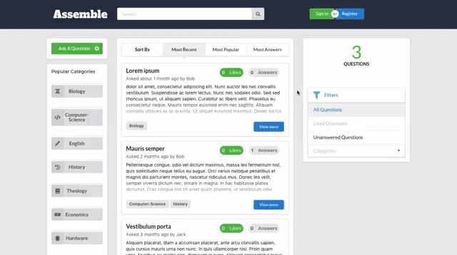

# Assemble

Assemble is a simple version of a Question & Answer style web application. Users are able to ask and answer questions. The application runs on three docker images:

- ui: React powered website which represents the end point for the user.

- app: Dotnet application which holds all the neccesary REST API, and the buisness logic to support the ui instance.

- db: a MySql database to store all information for the application.



---

## Prerequisites

To run this application you need two tools: **Docker** & **Docker Compose**.

Information on how to install **Docker** on [Ubuntu](https://docs.docker.com/install/linux/docker-ce/ubuntu/), [Windows](https://docs.docker.com/docker-for-windows/install/), [Mac](https://docs.docker.com/docker-for-mac/install/).

**Docker Compose** comes packaged with **Docker** on **Windows** and **Mac**, but not on **Linux**. Instructions to install **Docker Compose** on Linux can be found [here](https://docs.docker.com/compose/install/).

### How to run

Firstly navigate to the root directory and build the images:

```bash
$ docker-compose build
```

Then run the application (Allow for 1 minute for the three containers to finish booting):

```bash
$ docker-compose up -d
```

You may now view the application at <http://localhost:3000/>.

If you wish to stop the application use the following command:

```bash
$ docker-compose down
```

**OR** if you wish to stop and clear the data, use the following command:

```bash
$ docker-compose down -v
```
